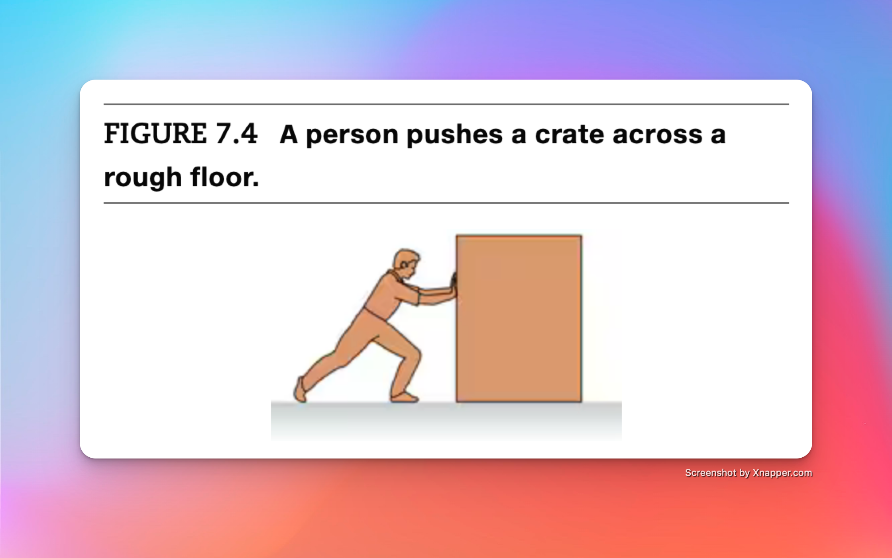
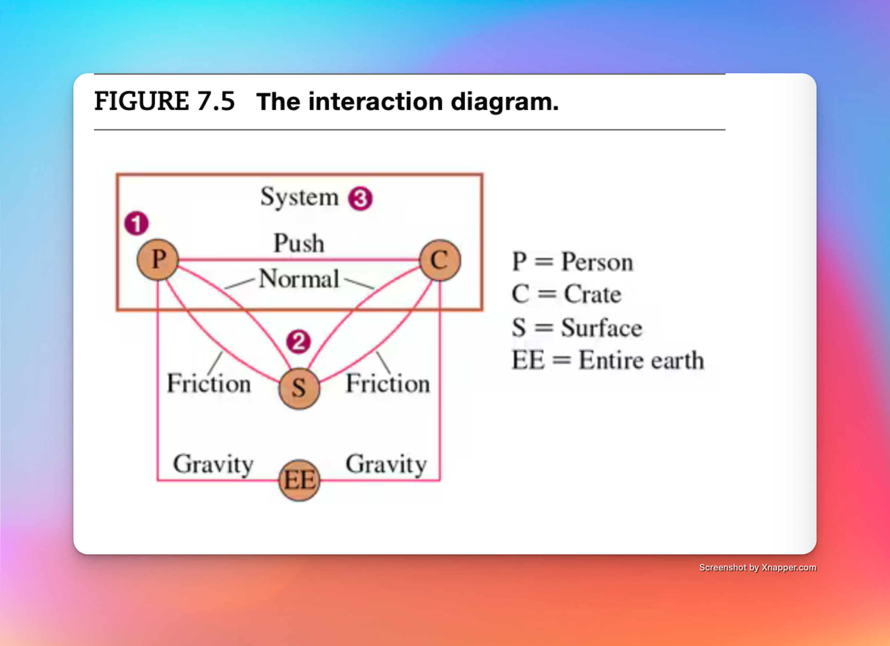
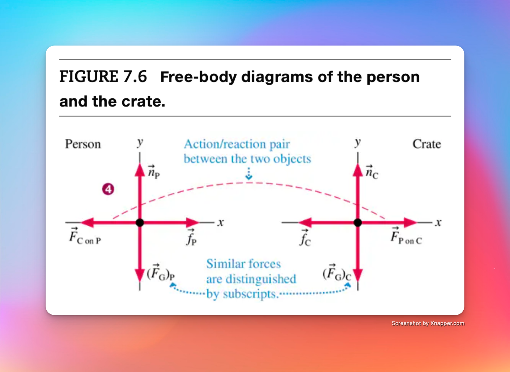
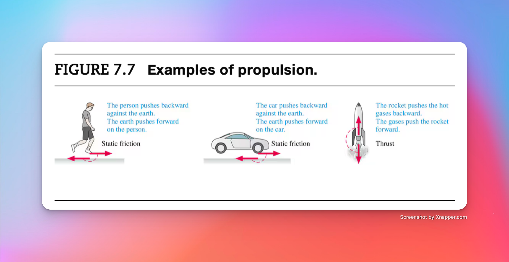
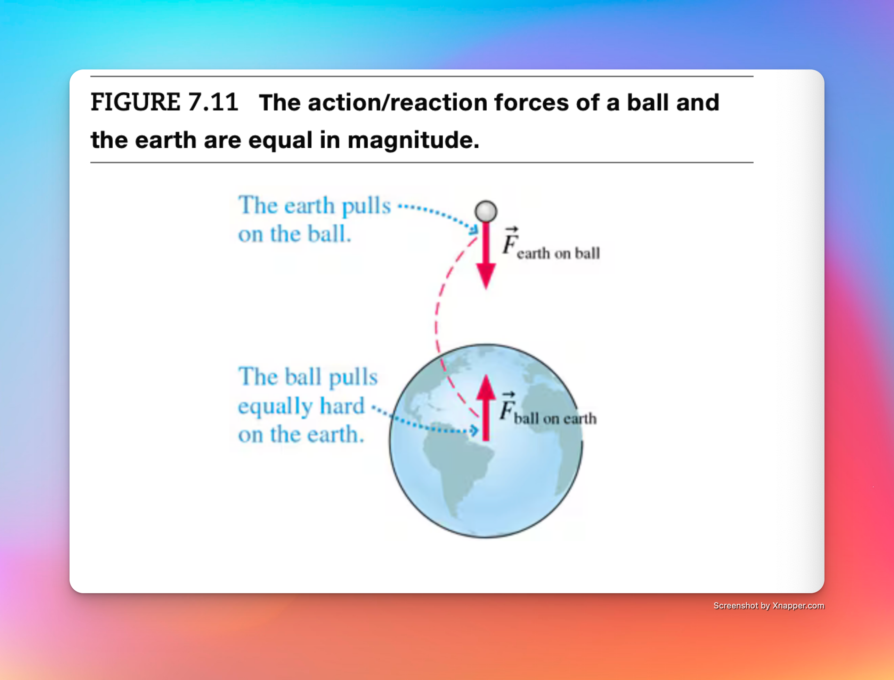

# Chapter 7: Newton's 3rd Law, Interacting objects

## 7.1 Interacting Objects

If obect A exterts a force $\vec{F}_{A / on / B}$ on Object B, then object B exerts a force $\vec{F}_{b \ on \ A}$ on object A. This pair of forces is called **action/reaction** pair.

Two objects **interact** by exerting an action/reaction pair of forcees on eachother.

Take note of the subscripts on the force vectors:

- The first letter is the agent.
- The second letter is the object on which the force acts.

Therefore, $\vec{F}_{A / on / B}$ is a force exerted by A on B. easy.

<https://plus.pearson.com/eps/pearson-reader/api/item/be8750ef-fd8f-444b-b3c0-1e8a4afe10e5/1/file/9780137319497_Knight_PhysicsFor_5_v1/OPS/images/07_002_95629_P164_1024.png>

The hammer and nail interact through contact forces. Does the same idea hold true for long-range forces such as gravity? *yes*

### 7.1.1 Objects, Systems, and the Environment

When working with multiple forces on interacting objects, we must first define the **system** as those objects whose motion we want to analyze and the **environment** as objects external to the system.

In model 7.3, this is a diagram called an **interaction diagram** where we've enclosed the objects of the system in a box and represented interactions as line connecting objects.

Notice that the interactions with objects in the environment are called **external forces.**

## 7,2 Analyzing Interacting Objects

Steps of Analyzing:

1. Represent each object as a cirlce with a name and label.
    - place each in the correct position relative to other objects. For example, the surface of the earth (contact forces) and the entire earth (long range forces).

2. Identify interactions.
    - Draw *one* connecting line between relevant circles to represent each interaction.
        - Every interaction line connects two and only two objects.
        - A surface can have two interactions: friction (parallel to the surface) and a normal force (perpendicular to the surface).
        - The entire earth interacts only by the long-range gravitational force.
3. Identify the system.
    - Identify the objects of interest; draw and label a box enclosing them. This completes the interaction diagram.
4. Draw a free-body diagram for each object in the system.
    - Include only the forces acting *on* each object, not forces exerted by the object.
        - Every interaction line crossing the system boundary is one external force acting on an object. The usual symbols, such as $\vec{n}$ and $\vec{T}$, can be used.
        - Every interaction line within the system represents an action/reaction pair of forces. There is one force vector on *each* of the objects, and these forces point in opposite directions. Use labels like $\vec{F}_{A \ on \ B}$
        - Connect the two action/reaction forces- which must be on *different* free-body diagrams - with a dashed line.

> We can use labels such as $\vec{n_P}$ and $\vec{f}_C$, however **it's very important to distinuish different forces with subscripts**

**The two forces of an action/reaction pair never occur on the same free-body diagram**

### 7.2.1 Propulsion

The friction force $\vec{f}_P$ (force of a surface on person) is an example of **propulsion.** It is a force that a system within internal source of energy uses to drive itself forward.

## Newton's Third Law

> **Newton's Third Law**
    - Every force occurs as one member of an action/reaction pair of forces.
        - The two memebers of an action/reaction pair act on two *different* objects.
        - The two members of an action/reaction pair are equal in magnitude but opposite in direction: $$\vec{F}_{A \ on \ B}=-\vec{F}_{A \ on \ B}$$

Often stated, "For every action there is an equal but opposite reaction." Do note: they each act on a *different* object. 

### 7.3.1 Reasoning with Newton's Third Law

Using a ball falling to the ground as an example. If the fall and the earth exert equal and opposite forces on eachother, why does the earth "fall up" to meet the ball? 

The key is **the forces are equal but the accelerations are not.** 

Figure 7.11 shows equal-magnitude forces on the ball and the eatch. 

The force on ball B is simply the gravitational force: 
(7.1) $$\vec{F}_{ball \ on \ earth}=(\vec{F_G})_B=-m_Bg icap$$

where $m_B$ is the mass of the ball. According to Newton's second law, this force give the ball an acceleration

(7.2)$$\vec{a}_B=\frac{(\vec{F}_G)B}{m_B}=-gicap$$

This is just familiar free-fall acceleration. 

According to Newton's third law, 

### 7.3.2 Acceleration Constraints 

## 7.4 Ropes and Pulleys 

### 7.4.1 Tension Revisited