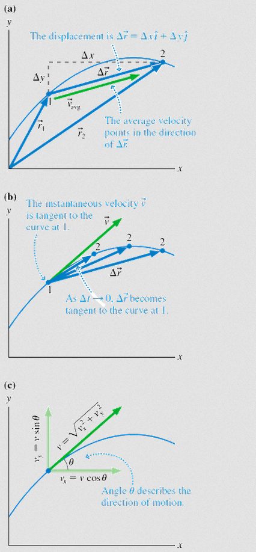
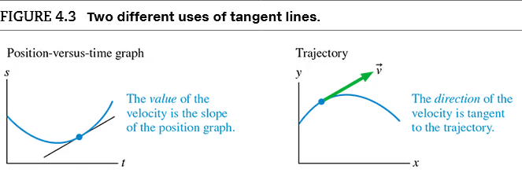
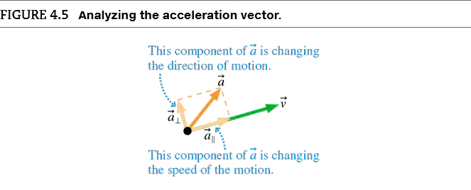
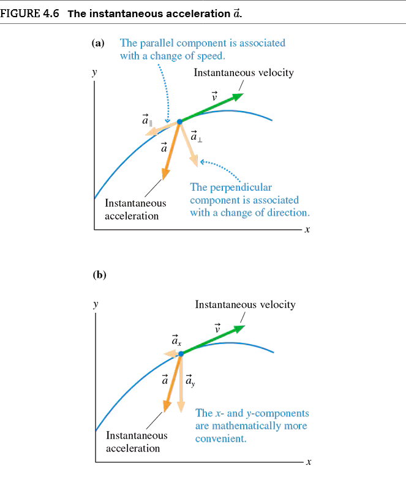

# Chapter 4: Kinematics in Two Dimensions
Ask yourself 
- How do objects accelerate in two dimensions? 
- What is projectile motion? 
- What is relative motion? 
- What is circular motion? 
- What is centripetal acceleration? 
- Where is two-dimensional motion used? 

## 4.1 Motion in Two Dimensions. 
()

### 4.1.1 Acceleration 

*Average acceleration* $\vec{a}_{avg}$ of a moving object is defined $$\vec{a}_{avg}=\frac{\Delta \vec{v}}{\Delta t}$$

$\vec{a}$ points in the same direction as $\Delta \vec{v}$. As an object moves, its velocity vector can change in two possible ways: 
1. The magnitude of $\vec{v}$ can change, indicating a change in speed.
2. The direction of $\vec{v}$ can change, indicating that the object has changed the direction. 

### 4.1.2 Acceleration Mathematically 

Note that $\vec{a}_{\perpen}$ always points towards the "inside" of the curve because that is the direction in which $\vec{v}$ is changing. 

Decomposition of $\vec{a}$ 
$$\vec{a}=a_x i +a_y j=\frac{d\vec{v}}{dt}=\frac{dv_x}{dt} i+ \frac{dv_y}{dt}j$$

and so, $$a_x=\frac{dv_x}{dt}\text{  and  } a_y=\frac{dv_y}{dt}$$

the $x$-component of $\vec{a}$ is the rate $dv_x/dt$ at which the velocity is changing. 

### 4.1.3 Constant Acceleration

Consider a particle that moves with constant acceleration from an initial position $\vec{r}_i=x_i i+y_i j$, starting with initial velocity $\vec{v}_i=v_{ix} i +v{iy}j$. It's position and velocity at a final point $f$ are: 

$$
\begin{aligned}
x_f &= x_i + v_{ix} \Delta t + \frac{1}{2} a_x (\Delta t)^2 \\
v_{fx} &= v_{ix} + a_x \Delta t \\
\\
y_f &= y_i + v_{iy} \Delta t + \frac{1}{2} a_y (\Delta t)^2 \\
v_{fy} &= v_{iy} + a_y \Delta t
\end{aligned}
$$

## 4.2 Projectile Motion
